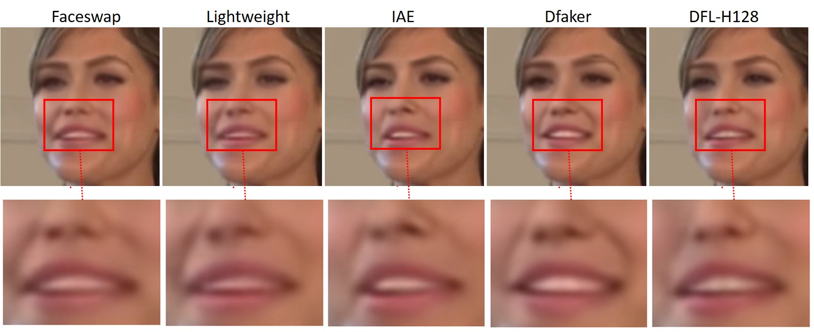

# Deepfake_Model_Attribution
Codes and dataset (*DFDM*) for Model Attribution of Face-swap Deepfake Videos 

We created a new dataset, named *DFDM*, with 6,450 Deepfake videos generated by different Autoencoder models. Specifically, five Autoencoder models with variations in encoder, decoder, intermediate layer, and input resolution, respectively, have been selected to generate Deepfakes based on the same input. We have first observed the visible but subtle visual differences among different Deepfakes, demonstrating the evidence of model attribution artifacts. Then we take Deepfakes model attribution as a multiclass classification task and propose a spatial and temporal attention based method to explore the differences among Deepfakes in *DFDM* dataset.

## Dataset Overview 
The DFDM dataset includes face-swap Deepfakes videos generated from five Autoencoder models based on [Faceswap](https://github.com/deepfakes/faceswap) software, including the *Faceswap*, *Lightweight*, *IAE*, *Dfaker*, and *DFL-H128*. Three H.264 compression rates are considered to get videos with different qualities, including lossless with the constant rate factor (crf) as 0, high quality with crf as 10, and low quality with crf as 23. A total of 6,450 Deepfakes have been created.

| Model | Input | Output | Encoder | Decoder | Variation| 
| :-------------------: | :-----: | :-----: | :---------: | :---------: | :---------: |
|  *Faceswap* (baseline)  |   64    |   64    |  4Conv+1Ups |  3Ups+1Conv |  /
|  *Lightweight*          |   64    |   64    |  3Conv+1Ups |  3Ups+1Conv |  Encoder|  
|  *IAE*                  |   64    |   64    |  4Conv      |  4Ups+1Conv |  Intermediate layers; Shared Encoder&Decoder|  
|  *Dfaker*               |   64    |   128   |  4Conv+1Ups | 4Ups+3Residual+1Conv |  Decoder|  
|  *DFL-H128*             |  128    |  128    |  4Conv+1Ups |  3Ups+1Conv |  Input resolution|  

### Download
If you would like to access the *DFDM* dataset, please fill out this [google form](https://docs.google.com/forms/d/e/1FAIpQLSeM-1pJ13RyPVgF0bGRQtLiupwWDvALD6rKa_Oa8sIluIqtSA/viewform?vc=0&c=0&w=1&flr=0&usp=mail_form_link). The download link will be sent to you once the form is accepted. If you have any questions, please send email to [dfdmdataset@gmail.com].

## Deepfake Model Attribution
We designed a simple and effective Deepfake video model attribution method based on Spatial and Temporal Attention (DMA-STA), and achieved an overall accuracy of ~70% in identifying the higher-quality Deepfakes in DFDM dataset.
### Usage
1. **Prerequisites**: our code requires PyTorch and Python 3. 

2. **Pre-trained model**: download the pretrained ResNet-50 model, put it into the 'data' folder, i.e., 'data/resnet50-19c8e357.pth'.

3. **Data structure**: DF_class*/Video*/Frame1.png, ... (cropped face images).

4. **Hyper-parameters**: you can modify 'config.py' to set more detailed hyper-parameters.
